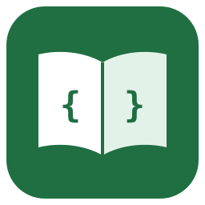

<p align="center"></p>

<h1 align="center">Spring Boot Edu</h1>

<p align="center">
  <b>Spring Boot 4.1 · Java 27</b> — modül modül, bol örnekli, Türkçe + İngilizce eğitim<br>
  a module-by-module, example-driven course in Turkish + English
</p>

<p align="center">
  <a href="../../actions/workflows/ci.yml"></a>
</p>

---

[🇹🇷 Türkçe](#-türkçe) · [🇬🇧 English](#-english) · [Modüller / Modules](#modüller--modules)

## 🇹🇷 Türkçe

Bu repo, Spring Boot'un güncel sürümünü **çalışan kodla** öğreten bir eğitim projesidir. Her modülde:

- 📖 **Ders notları** — Markdown ve PDF, Türkçe ve İngilizce
- 🧪 **Çalıştırılabilir örnekler** — her örneğin testi var
- 🏋️ **Ödevler** — testleri hazır başlangıç kodu; testler yeşile dönünce ödev bitti demektir
- ✅ **Çözümler** — takıldığınızda bakabileceğiniz referans çözüm

Tüm örnekler aynı **Kitapçı (Bookstore)** domain'i üzerinde ilerler: `Book`, `Author`, `Customer`, `Order`, `Review`.

### Ön koşullar

| Araç | Sürüm | Not |
|---|---|---|
| JDK | **27** | `java -version` → 27. Maven'ı çalıştıran JDK'nın da 27 olması gerekir. |
| Docker | Docker Desktop / Engine | En az **8 GB RAM** ayırın (tüm servisler için 10–12 GB önerilir) |
| Git | herhangi | |
| kind, kubectl, helm | güncel | yalnızca modül 22, 23 ve capstone için |
| Ollama modeli | — | yalnızca modül 24 için (Docker ile gelir) |

Maven kurmanıza gerek yok, repo Maven Wrapper (`./mvnw`) ile gelir.

### Hızlı başlangıç

```bash
git clone git@github.com:aliturgutbozkurt/spring-boot-edu.git
cd spring-boot-edu
export JAVA_HOME=$(/usr/libexec/java_home -v 27)   # macOS; Linux/Windows: JAVA_HOME'u JDK 27'ye ayarlayın

./mvnw verify                                        # her şeyi derle ve test et (Docker açık olmalı)
./mvnw -pl modules/01-core-container/lesson spring-boot:run   # bir dersi çalıştır
```

Bir ders veritabanı veya başka bir servis gerektiriyorsa **Docker Compose otomatik başlatır**. Elle başlatmak için:

```bash
docker compose --profile postgres up -d --wait    # profiller: postgres, mongo, elastic, redis, kafka, hazelcast, observability, ai, all
docker compose --profile all down -v               # durdur ve verileri sil
```

### Ödev nasıl yapılır?

1. Modülün `docs/tr/odevler.md` (veya PDF) dosyasını okuyun.
2. `modules/<modül>/exercise/` içindeki `TODO`'ları tamamlayın.
3. Testleri çalıştırın. Hepsi yeşilse ödev bitmiştir:

   ```bash
   ./mvnw -Pexercises -pl modules/<modül>/exercise test
   ```

4. Takılırsanız `modules/<modül>/solution/` içindeki çözüme bakın.

## 🇬🇧 English

This repository teaches the current Spring Boot release **through working code**. Every module contains:

- 📖 **Lesson notes** — Markdown and PDF, in Turkish and English
- 🧪 **Runnable examples** — every example has a test
- 🏋️ **Exercises** — starter code with ready-made tests; when the tests turn green, you are done
- ✅ **Solutions** — a reference solution for when you get stuck

All examples share one **Bookstore** domain: `Book`, `Author`, `Customer`, `Order`, `Review`.

### Prerequisites

| Tool | Version | Note |
|---|---|---|
| JDK | **27** | `java -version` → 27. The JDK running Maven must be 27 as well. |
| Docker | Docker Desktop / Engine | Give it at least **8 GB RAM** (10–12 GB recommended for all services) |
| Git | any | |
| kind, kubectl, helm | current | only for modules 22, 23 and the capstone |
| Ollama model | — | only for module 24 (runs in Docker) |

No Maven installation needed: the repository ships the Maven Wrapper (`./mvnw`).

### Quick start

```bash
git clone git@github.com:aliturgutbozkurt/spring-boot-edu.git
cd spring-boot-edu
export JAVA_HOME=$(/usr/libexec/java_home -v 27)   # macOS; Linux/Windows: point JAVA_HOME to JDK 27

./mvnw verify                                        # build and test everything (Docker must be running)
./mvnw -pl modules/01-core-container/lesson spring-boot:run   # run a lesson
```

If a lesson needs a database or another service, **Docker Compose starts it automatically**. To start services yourself:

```bash
docker compose --profile postgres up -d --wait    # profiles: postgres, mongo, elastic, redis, kafka, hazelcast, observability, ai, all
docker compose --profile all down -v               # stop and wipe data
```

### How to do the exercises

1. Read the module's `docs/en/exercises.md` (or the PDF).
2. Complete the `TODO`s in `modules/<module>/exercise/`.
3. Run the tests. When they are all green, you are done:

   ```bash
   ./mvnw -Pexercises -pl modules/<module>/exercise test
   ```

4. Stuck? Look at the reference solution in `modules/<module>/solution/`.

## Modüller / Modules

Önerilen sıra yukarıdan aşağıya. / Recommended order is top to bottom.

📅 Müfredat — haftalık plan, ön koşullar, kazanımlar / Syllabus — weekly plan, prerequisites, outcomes:
🇹🇷 [Müfredat](docs/syllabus.tr.md) ([PDF](docs/syllabus.tr.pdf)) · 🇬🇧 [Syllabus](docs/syllabus.en.md) ([PDF](docs/syllabus.en.pdf))

| # | Modül / Module | Konular / Topics | Altyapı / Infra |
|---|---|---|---|
| 00 | Kurulum ve Modern Java / Setup & Modern Java | JDK 27, records, sealed types, pattern matching, virtual threads, scoped values | — |
| 01 | Spring Core Container | IoC/DI, bean lifecycle, scopes, profiles, conditions, `BeanRegistrar`, events, AOP | — |
| 02 | Konfigürasyon / Configuration | auto-configuration, `@ConfigurationProperties`, profiles, custom starter | — |
| 03 | Web MVC | REST, validation, `ProblemDetail`, API versioning, Jackson 3, OpenAPI | — |
| 04 | HTTP İstemcileri ve Dayanıklılık / HTTP Clients & Resilience | `RestClient`, HTTP interfaces, `@Retryable`, `@ConcurrencyLimit` | — |
| 05 | Spring JDBC | `JdbcClient`, Flyway, Spring Data JDBC, transactions | PostgreSQL |
| 06 | Spring Data JPA | Hibernate 7, relations, N+1, projections, specifications, locking | PostgreSQL |
| 07 | Spring Data MongoDB | document modelling, aggregation, indexes, transactions | MongoDB |
| 08 | Redis ve Önbellek / Redis & Caching | Spring Cache, Redis data structures, pub/sub, Spring Session | Redis |
| 09 | Hazelcast | embedded vs client-server, `IMap`, near cache, distributed locks | Hazelcast |
| 10 | Elasticsearch | mapping, full-text search, aggregations, highlighting, sync | Elasticsearch |
| 11 | Kafka ile Mesajlaşma / Messaging with Kafka | producers/consumers, retry + DLT, transactions, outbox, Streams | Kafka |
| 12 | Güvenlik / Security | Spring Security 7, JWT resource server, Authorization Server, method security | PostgreSQL |
| 13 | Reaktif Programlama / Reactive | Reactor, WebFlux, R2DBC, reactive MongoDB, SSE | PostgreSQL, MongoDB |
| 14 | Test | slice tests, `MockMvcTester`, `RestTestClient`, Testcontainers, ArchUnit | all |
| 15 | Gözlemlenebilirlik / Observability | Actuator, Micrometer, OpenTelemetry, structured logging, Grafana | LGTM |
| 16 | Async, Zamanlama, Batch / Async, Scheduling, Batch | `@Async`, `@Scheduled`, Spring Batch 6 | PostgreSQL |
| 17 | GraphQL ve WebSocket | Spring for GraphQL, DataLoader, subscriptions, STOMP | PostgreSQL |
| 18 | Spring Modulith | module boundaries, application events, event publication registry | PostgreSQL |
| 19 | Native ve Performans / Native & Performance | AOT, GraalVM native image, CDS / AOT cache | — |
| 20 | Docker ve Dağıtım / Docker & Deployment | Dockerfile, Buildpacks, health probes, graceful shutdown | all |
| 21 | gRPC | Spring gRPC, protobuf, streaming, interceptors | — |
| 22 | Kubernetes | kind, Deployments, ConfigMaps, probes, Kustomize, HPA | kind |
| 23 | Spring Cloud | Gateway, Config Server, OpenFeign, Circuit Breaker, Spring Cloud Kubernetes | kind |
| 24 | Spring AI | `ChatClient`, structured output, RAG with pgvector, tool calling, MCP | Ollama, PostgreSQL |
| — | [Bitirme Projesi / Capstone](capstone/README.md) | Bookstore platform: gateway + 4 services, gRPC, outbox, Kafka, Helm — every technology above | all |

İlerleme / Progress: [tasks/todo.md](tasks/todo.md) · [GitHub Issues](../../issues) · [Milestones](../../milestones)

## Repo yapısı / Repository layout

```
build-parent/        Maven parent: Spring Boot 4.1.1, Java 27, shared plugin config
compose.yaml         Local infrastructure, grouped by Docker Compose profiles
modules/NN-topic/    lesson/ · exercise/ · solution/ · docs/{tr,en}/ · README.md
capstone/            Final project
docs/                Syllabus, templates, PDF toolchain
scripts/             build-pdfs.sh · new-module.sh · check-module.sh
SPEC.md              Course specification (scope, decisions)
CLAUDE.md            Conventions for contributors and AI agents
```

## Katkı / Contributing

Bu proje **spec-driven development** ile geliştirilir: kapsam [SPEC.md](SPEC.md)'de, plan [tasks/plan.md](tasks/plan.md)'de, kurallar [CLAUDE.md](CLAUDE.md)'dedir.
This project follows **spec-driven development**: scope lives in [SPEC.md](SPEC.md), the plan in [tasks/plan.md](tasks/plan.md), and conventions in [CLAUDE.md](CLAUDE.md).

## Lisans / License

Kod / Code: [MIT](LICENSE) · Dokümanlar / Docs: [CC BY-SA 4.0](LICENSE-docs)
